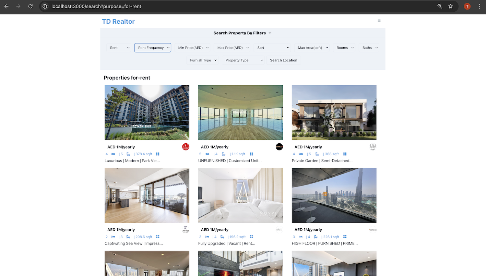
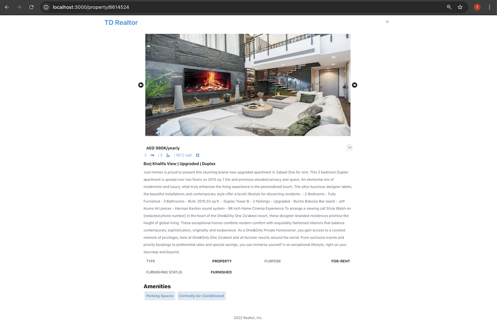

Live Demo: https://tdrealestateapp.vercel.app/


# Setup

- Install [Node](https://nodejs.org/en/download/)
- Install [Git](https://git-scm.com/book/en/v2/Getting-Started-Installing-Git)
- Clone the repository `https://github.com/tddag/realestateapp`
- Install dependencies `npm install`
- Setup [RapidAPI](https://rapidapi.com/)
- Setup environment variables:
  - <table>
        <tr>
            <th>Variable</th>
            <th>Value</th>
            <th>Description</th>
        </tr>
        <tr>
            <td>RAPID_API_HOST</td>
            <td>bayut.p.rapidapi.com</td>
            <td>Rapid API Host</td>
        </tr>   
        <tr>
            <td>RAPID_API_KEY</td>
            <td>2e5d9595....</td>
            <td>Rapid API Key</td>
        </tr>                                                   
    </table>
- Run the application `npm run dev`


# Functionalities
- Property Listing for Rent or Buy
    <table>
        <tr>
            <td></td>
        </tr>
    </table>
- Property Filter
    <table>
        <tr>
            <td></td>
        </tr>
    </table>
- Prooperty Details
    <table>
        <tr>
            <td></td>
        </tr>
    </table>

# Technologies/Libraries
- NextJS: React Framework
- React: Web library
- RapidAPI: API marketplace
- CharkaUI: React components
- axios: promised-based HTTP Client
- framer-motion: animation-library
- millify: converts long numbers into pretty, human-readable strings
- nprogress: progress bar


This is a [Next.js](https://nextjs.org/) project bootstrapped with [`create-next-app`](https://github.com/vercel/next.js/tree/canary/packages/create-next-app).

## Getting Started

First, run the development server:

```bash
npm run dev
# or
yarn dev
```

Open [http://localhost:3000](http://localhost:3000) with your browser to see the result.

You can start editing the page by modifying `pages/index.js`. The page auto-updates as you edit the file.

[API routes](https://nextjs.org/docs/api-routes/introduction) can be accessed on [http://localhost:3000/api/hello](http://localhost:3000/api/hello). This endpoint can be edited in `pages/api/hello.js`.

The `pages/api` directory is mapped to `/api/*`. Files in this directory are treated as [API routes](https://nextjs.org/docs/api-routes/introduction) instead of React pages.

## Learn More

To learn more about Next.js, take a look at the following resources:

- [Next.js Documentation](https://nextjs.org/docs) - learn about Next.js features and API.
- [Learn Next.js](https://nextjs.org/learn) - an interactive Next.js tutorial.

You can check out [the Next.js GitHub repository](https://github.com/vercel/next.js/) - your feedback and contributions are welcome!

## Deploy on Vercel

The easiest way to deploy your Next.js app is to use the [Vercel Platform](https://vercel.com/new?utm_medium=default-template&filter=next.js&utm_source=create-next-app&utm_campaign=create-next-app-readme) from the creators of Next.js.

Check out our [Next.js deployment documentation](https://nextjs.org/docs/deployment) for more details.
